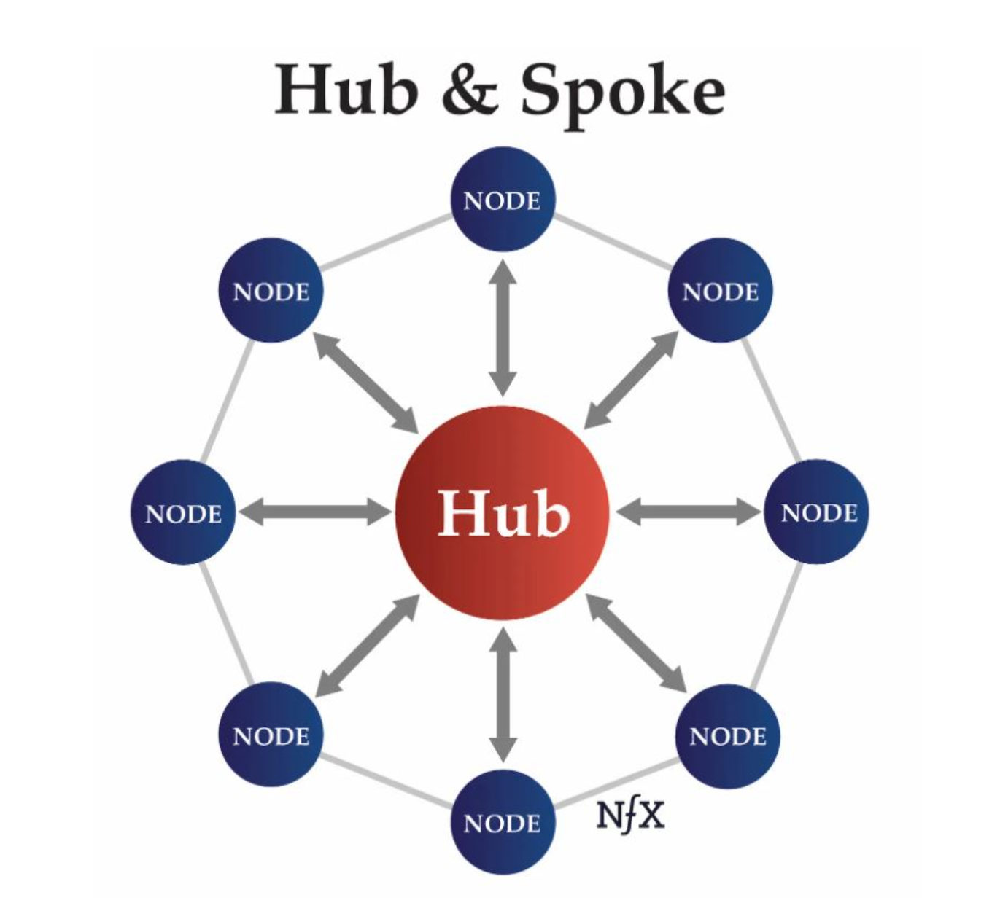
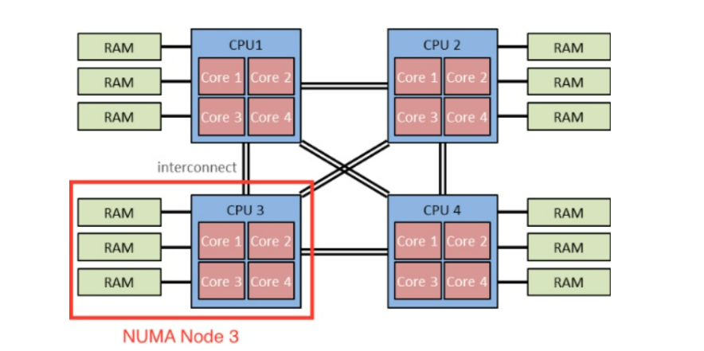

막히는 부분은 정말 많았지만... Docs 내에서 직접적으로 설명하지 않는 개념 위주로 간단하게 정리해보았습니다.

### 노드에서 컨트롤 플레인으로의 통신 - 허브 앤 스포크(hub-and-spoke)" API 패턴

다양한 분야에서 쓰이는데 IT와의 접점을 찾아보자면 WAN 네트워크의 구축에서 쓰인다고 한다.  
개념 자체는 시스템이 서로 통신 구조를 가지는 대신 Hub를 통해서만 통신하는 아키텍쳐 구조라고한다.  
쿠버네티스에서 해당 의미는 쿠버네티스의 모든 구성요소(kubelet, 스케쥴러, Controller) 가 서로 직접 통신하는 것이 아닌 kube-apiserver를 통해서 통신하는 것을 나타낸다. 장점은 역시 연결의 갯수가 N개의 노드에서 N 개 라는 점일 것이다.  

### 클러스터 아키텍쳐 - cGroup v2 : Pressure Stall information / 다중 자원에 걸친 향상된 자원 할당 관리 및 격리 (Page Cache Write Back)

#### PSI(Pressure Stall Information)

OS 에서 리소스 부족으로 인한 장애와 복잡한 Workload 또는 전체 시스템에 미치는 시간적 영향을 식별하고 정량화 한다고 한다.  
쉽게 설명하자면 기존에는 "CPU 사용률이 90프로" 라고 알려 준다면, PSI는 "자원의 부족 때문에 프로세스들이 실행되지 못하고 10초 중 2초에 stall 되어있었다." 이런 식으로 구체적으로 알려준다고 한다.  
각 리소스에 대한 압력 정보는 /proc/pressure/ 디렉터리에 있는 해당 파일을 통해 내보내어 지고 형식은 아래와 같다.  

`some avg10=0.00 avg60=0.00 avg300=0.00 total=0
full avg10=0.00 avg60=0.00 avg300=0.00 total=0`

"일부" 항목은 주어진 리소스에서 적어도 일부 작업이 지연되는 시간의 비율,  
"전체" 라인은 모든 비유휴 작업이 특정 리소스에서 동시에 정체된 상태로 있는 시간의 비율이다.  

쿠버네티스는 해당 기능을 통하여 HPA, 노드관리 등에 사용하고 있다.

#### Page Cache WriteBack

기존의 Page Cache WriteBack 과 비교하여 향상된 기능을 제공한다고 한다.  
우선 WriteBack이 조금 생소해서 찾아보니 데이터를 쓸 때 메모리에 쓰지않고 캐시로부터  
해제되는 때에 디스크에 쓰는 기법으로 Page Cache가 앞에 붙었다면 Dirty Page에 있는 데이터를 Disk에 쓴다는 것인데, cGroup v1 과 cGroup v2는 어떻게 다른 걸까?  

cGroup v1
WriteBack 작업을 커널이 공용으로 처리했기 때문에, 어떤 파드가 이 데이터를 만들었는지 추적하기가 어려웠다.

cGroup v2
어떤 pod가 Dirty_Page를 만들었는지 정확히 추적한다. 덕분에 특정 pod가 과도한 WriteBack을 일으켜 노드 전체의 I/O를 점유하는 것을 막고, 정확한 I/O Pressure를 측정한다.

리눅스 커널 위키에서 더 자세한 정보를 찾아 볼 수 있었다.
위와 같은 캐시 라이트백 IO 제어의 구현을 위해 더티 메모리 비율이 계산되고 유지되는 '메모리 영역'을 정의 하는 메모리 컨트롤러와 해당 메모리 영역의 더티 페이지를 실제로 기록하는 'IO 영역'을 정의하여 IO 컨트롤러가 협력하여 시스템 전체의 상태와 cgroup별 더티 메모리 상태를 모두 검사하며, 이 중 더 엄격한 기준으로 제한된다고 한다.

WriteBack은 아이노드(Inode) 단위로 추적되며, 라이트백을 위해 아이노드는 특정 cgroup에 할당되며, 해당 아이노드의 더티 페이지를 기록하는 모든 IO 요청은 그 cgroup의 소유로 간주된다.

### 워크로드 - 리소스 매니저 : CFS

CPU 관리자에 따르면 kubelet은 CFS 할당량을 사용하여 POD의 CPU 사용량을 제한한다고 한다. CFS 가 무엇일까..?

Completely Fair Scheduler(완전 공정한 스케쥴러)

CFS 의 목표는 "모든 runnable 프로세스에게 수학적으로 완벽하게 공평한 CPU 시간을 분배" 하는 것이다. 공평함을 측정하는 기준은 vruntime(가상 런타임)으로 단순하게, 모드 프로세스가 CPU를 사용할 때마다 vruntime이 늘어나게 되는데 커널은 이 vruntime이 가장 작은 프로세스에게 우선적으로 CPU를 할당하게 된다고 한다.
하지만, 당연하게도 모든 프로세스의 중요도가 동일할 리 없기 때문에, 우선순위 값(NICE)를 사용하게 된다. 중요한 건 nice 값에 따라 vruntime이 올라가는 속도가 달라진다고 하며 이것이 가중치 스케줄링의 핵심이다.

Nice가 낮다면, 고우선순위로 실제로 1ms 일했다고 했어도 vruntime은 0.1 만큼 오르게 된다. 반면 Nice가 높다면, 저우선 순위로 실제로 1ms 일해도 vruntime이 훨씬크게 10ms 정도가 오르게 된다. 이렇게 되면 CFS는 공정한 스케쥴링을 위해서 vruntime이 낮은 쪽에 cpu를 할당하게 되고 따라서 낮은 nice 값을 가진 프로세스가 cpu를 점유할 수 있게 된다.

커널이 이 수많은 프로세스들을 vruntime 순서대로 어떻게 정렬하는지 알기 위해서는 균형 트리중 하나인 레드 - 블랙 트리를 사용해야한다고 한다.

### 워크로드 - 리소스 매니저 : NUMA

CPU 코어수가 늘어남에 따라서 메모리를 주소별 구간으로 나눈뒤 각 주소에 맞게 CPU 별로 나누어 접근하게 한다. 하나의 메모리라도 구간이 나누어져 있기 때문에 병목문제의 해결이 가능하다. 그렇게 CPU코어들과 CPU 소켓과 가깝게 꽂힌 RAM을 묶은 단위를 NUMA 노드라고 한다.

그렇다면 돌아와서 NUMA 기법이 쿠버네티스에서 중요한 이유는 다음과 같다.
쿠버니테스는 기본적으로는 NUMA를 고려하지 않고 리소스를 스케쥴하는데
파드에 할당된 자원이 2개 이상의 NUMA 노드에 걸쳐있을 수 있다.
또한 cpu는 0번 노드에서 할당받았는데 메모리는 1번 노드일 수도 있다.
그렇기 때문에 리소스 매니저를 통해서 일관된 NUMA 노드의 자원을 할당받을 수 있게 한다.

