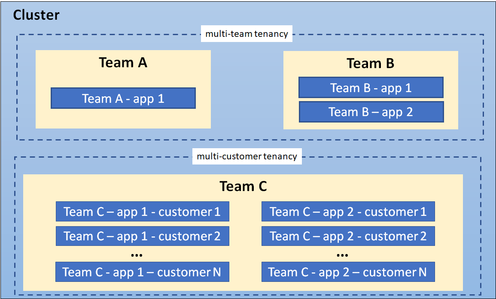

## 구성

**인트로스펙션(introspection)**  
: 시스템이 자기 자신의 구조나 상태를 스스로 조회할 수 있는 기능

쿠버네티스 오브젝트를 생성할 때, 더 나은 인트로스펙션(introspection)을 위해서, 어노테이션에 오브젝트의 설명을 넣는 것이 바람직하다.

**컨피그맵(ConfigMap)**  
: 키-값 쌍으로 기밀이 아닌 데이터를 저장하는 데 사용하는 API 오브젝트  
-> 애플리케이션 설정을 컨테이너 이미지와 분리하기 위한 쿠버네티스 객체 (설정값 저장해 놓는 파일이라고 생각하면 됨)

스태틱 파드는 API Server 없이도 실행 가능해야 하기 때문에 API Server에 저장되는 리소스인 Configmap, Secret 등을 사용할 수 없음... 대신 로컬 파일을 직접 사용함

<pre>
/etc/myapp/config.yaml
</pre>

이런 식으로 노드에 파일을 만들고, 스태틱 파드에서 HostPath로 마운트함

#### 시크릿(Secret)

쿠버네티스는 내가 만든 Secret이 어떤 용도인지(DB 비밀번호, TLS 인증서 등) 모르기 때문에 type을 적어서 알려줌!

1. 불투명(Opaque) 시크릿
   - 타입 미지정 저장... 쿠버네티스는 무슨 시크릿인지 신경 안 쓰고 저장만 해줌
2. Service Account Token
   - 쿠버네티스 API에 접속할 때 쓰는 토큰
3. 도커 컨피그 시크릿
   - 도커 resitory에 있는 이미지 다운로드용 로그인 정보
4. 기본 인증(Basic authentication) 시크릿
   - opaque로도 가능하지만 `username`, `password`를 쿠버네티스가 형식 검사 가능함
5. SSH 인증 시크릿
   - SSH 접속용 개인 키 저장
6. TLS 시크릿
   - HTTPS 만들 때 필요한 인증서 및 관련된 키 저장
7. 부트스트랩 토큰 시크릿
   - 새 노드가 클러스터에 들어올 때 확인하는 토큰

#### 파드 및 컨테이너 리소스 관리

파드가 CPU, 메모리를 얼마나 쓸 건지 Kubernetes에 알려줘야 한다.

Request: 최소 보장량
Limit: 최대 사용 가능량

<CPU 단위>  
1 CPU = CPU 코어 1개  
`1000m(milliCPU) = 1 CPU`  
`cpu: 500m = cpu: 0.5`

<pre>
resources:
  requests:
    cpu: "1"

  limits:
    cpu: "4"
</pre>

- `request` = 1 CPU → 최소 1 CPU는 필요함

- `limit` = 4 CPU → 최대 4 CPU까지는 써도 됨 (최대 예상 사용량)

#### 프로브(Probe)

쿠버네티스가 애플리케이션 상태를 직접 확인하는 것

**1. Startup Probe (시작 프로브)**  
: 애플리케이션이 정상적으로 기동을 마쳤는가를 확인

예를 들어 Spring Boot가 시작될 때 클래스 로딩 2. Bean 생성 3. DB 연결 4. 캐시 초기화 등을 수행하느라 30초가 걸릴 수 있다. 그런데 활성화됐는지 5초마다 검사하도록 설정되어 있으면 아직 부팅 중인데 응답이 없다고 판단해서 계속 재시작시켜 버릴 수 있다. 그래서 Startup Probe를 사용한다.

**Startup Probe가 성공하기 전까지는 Liveness Probe와 Readiness Probe를 실행하지 않는다.**  
-> 주로 시작 시간이 긴 애플리케이션에 사용함

**2. Readiness Probe (준비성 프로브)**  
: 지금 사용자 요청을 받아도 되는가를 확인

서버가 실행 중인데, DB 연결 실패, 외부 API 장애, 캐시 초기화 중 이런 상황들이라면 요청을 받으면 안 된다. 이때 Readiness Probe가 실패하면 쿠버네티스는 해당 파드를 Service의 Endpoint 목록에서 제거한다.  
=> 컨테이너는 계속 실행하는데(재시작 X) 단지 트래픽만 안 받는 것!!!

<pre>
- Pod A: Ready
- Pod B: Ready
- Pod C: Not Ready
</pre>

예를 들어 파드가 3개가 있는데 이런 상황이라면 서비스는 Pod A, B에게만 트래픽을 보냄

**3. Liveness Probe (활성 프로브)**  
: 애플리케이션이 정상적으로 살아 있는가를 확인

Deadlock이 걸럈거나 무한루프 발생한다던가... 프로세스는 살아 있지만 실제 서비스는 못 하는 상태에서 Readiness Probe만 사용하면트래픽은 안 받게 만들 수 있지만 자동 복구는 안 된다! 그래서 **Liveness Probe가 실패하면 kubelet이 컨테이너를 강제로 재시작한다.**

**kubeconfig**  
: kubectl은 사실 API Server에 요청을 보낼 때 필요한 정보들을 저장하는 파일 (클러스터 주소, 사용자, 인증서 등)  
=> kubectl은 **kubeconfig를 읽어서 어느 클러스터에 누구로 접속할지 결정**한 뒤 API Server와 통신함

<pre>
apiVersion: v1
kind: Config

clusters:
- name: my-cluster // 클러스터
  cluster:
    server: https://10.0.0.100:6443

users:
- name: admin // 사용자
  user:
    token: xxxxx

contexts:
- name: admin-context
  context:
    cluster: my-cluster
    user: admin
    namespace: default // 기본 네임스페이스

current-context: admin-context // 현재 사용할 설정
</pre>

## 보안

**ServiceAccount**  
: 파드가 Kubernetes API Server에 접근할 때 사용하는 신원(Identity)

**RBAC (Role Based Access Control)**  
: 역할 기반 접근 제어
-> 누가 어떤 일들(Pod 조회, Secret 조회 등)을 할 수 있는지 권한을 부여하는 것

**ResourceQuota**
: 네임스페이스 전체 자원 사용량 제한 기능

해당 네임스페이스 안에서 CPU, 메모리 등 얼마나 쓸 수 있는지 정함! 새 파드가 뭘 더 요청했을 때 quota에 적은 수를 초과한다? 그러면 생성 거부...

주의점: 실제 사용량이 아닌 선언된 request/limit의 합만 계산해서 취급함

**LimitRange**  
: 각 파드/컨테이너의 request, limit 범위 제한 기능

각 컨테이너는 최소 cpu 몇, 메모리 몇 이상 ~ 최대 몇 이하로 요청해야 한다. 이런 규칙을 적어놓고 규칙에 어긋나면 생성을 거부함

**Container Escape (컨테이너 탈출)**  
: 컨테이너는 원래 호스트 OS와 격리되어 실행되는데, 취약점이나 잘못된 설정을 이용해 컨테이너 밖으로 탈출하여 호스트 OS 수준의 권한을 획득하는 공격

탈출에 성공하면 공격자는 해당 노드(호스트 OS)를 제어할 수 있게 되고, 그 결과 같은 노드에서 실행 중인 다른 컨테이너와 서비스에도 접근하거나 영향을 줄 수 있음

**공급망 보안 (Supply Chain Security)**  
: 소프트웨어를 만들고 배포하는 과정에서 사용하는 모든 구성 요소(라이브러리, 패키지, 컨테이너 이미지, 빌드 도구 등)가 위변조되지 않았고 안전한지 검증하는 보안

- 이미지 취약점 스캔
- 이미지 서명(Signing)
- SBOM(Software Bill of Materials)
- 이미지 무결성 검증

**Zero Trust**  
: 아무도 기본적으로 신뢰하지 않는다(Never Trust, Always Verify)는 보안 모델  
-> 외부 침입자가 내부 사용자인 척 행동할 수 있기 때문에 모든 사용자와 서비스의 요청을(ex. 같은 클러스터 내 Pod더라도) 매번 인증하고 권한을 확인함

**HSM (Hardware Security Module)**  
: 암호화 키를 안전하게 저장하고 암호화 작업을 수행하는 전용 보안 하드웨어 장치

키를 일반 서버에 저장하면 서버가 해킹당했을 때 키도 같이 유출된다. HSM은 내부에 키를 저장하면 키를 밖으로 꺼내지 않는다!!!  
서버는 이 데이터를 서명해 달라고 요청만 보내고, **HSM이 내부에서 암호화, 복호화, 서명, 검증을 수행하고 결과만 반환한다.**  
=> 공격자가 서버를 털어도 실제 비밀키는 가져가기 어려움

**Observability (관찰 가능성)**  
: 로그, 메트릭, 트레이스를 수집·분석하여 시스템 내부 상태와 장애 원인을 파악할 수 있게 하는 능력

핵심 3요소

1. **Logs (로그)** - 애플리케이션이 남기는 기록

   로그인 성공, 주문 생성, 결제 실패, Exception 발생 등 개별 이벤트를 확인하는 데 사용

2. **Metrics (메트릭)** - 숫자 형태의 상태 정보

   CPU 사용률, 메모리 사용량, 요청 수, 응답 시간, 에러율 등 시스템 상태를 전체적으로 파악하는 데 사용

3. **Traces (트레이스)** - 하나의 요청이 여러 서비스를 거쳐 가는 경로를 추적

   트레이싱을 사용하면 어디가 병목인지 알 수 있음

**파드 시큐리티 스탠다드**  
: 쿠버네티스가 이런 위험한 설정 가진 파드는 실행 못하게 막자!라고 정한 보안 규칙 모음

| 정책 레벨        | 의미             |
| ---------------- | ---------------- |
| 특권(Privileged) | 거의 다 허용     |
| 기본(Baseline)   | 위험한 것만 금지 |
| 제한(Restricted) | 최대한 안전하게  |

**샌드박스(Sandbox)**  
: 프로그램을 안전한 격리 공간 안에 가두어 실행하는 보안 기법

**샌드박스 파드(Sandbox Pod)**  
: 일반 컨테이너보다 더 강한 격리 기술(gVisor, Kata 등)을 사용해서 실행되는 파드  
-> 파드를 일반 컨테이너 런타임이 아니라 더 강한 격리를 제공하는 샌드박스 런타임에서 실행함

<pre>
Pod
 └─ Container
      ↓
    gVisor
      ↓
 Host Linux Kernel
</pre>

이런 식으로 컨테이너가 시스템콜을 호출하면 바로 커널에 가는 게 아니라 gVisor가 먼저 받아서 처리한다. 그럼 공격자가 컨테이너를 뚫어도 바로 호스트 커널에 닿기 어려워진다.

**어드미션 컨트롤러(Admission Controller)**  
: API Server로 보낸 요청을 먼저 받는 컨트롤러

**멀티 테넌시(multi-tenancy)**  
: 한 쿠버네티스 클러스터를 여러 사용자(팀, 고객)가 안전하게 같이 쓰는 방법

종류)

- 1. Multi-Team: 한 회사 안 여러 팀
- 2. Multi-Customer: SaaS 서비스(ex. 노션 - 여러 사용자)

**Hard Multi-Tenancy**  
: 각각 Tenant가 서로를 신뢰 안 함

-> 만약 고객 A가 해킹당하면 고객 B 데이터까지 털릴 수 있음... 그래서 네트워크 격리, 노드 격리, 샌드박스, 별도 클러스터 등을 사용

**Soft Multi-Tenancy**  
: 각각 Tenant가 어느 정도 신뢰함

같은 회사 직원들끼리 실수는 걱정되지만 악의적인 공격자는 아님 그래서 Namespace, RBAC, ResourceQuota 정도로 가볍게 격리함

## 정책

**Fork Bomb**  
: 프로세스가 자기 자신을 계속 복제(fork)해서 시스템의 PID와 CPU 자원을 순식간에 소모시키는 공격 또는 버그

몇 초 안에 수만~수십만 개의 프로세스가 생성되면 PID가 고갈되고, CPU 100%나 메모리 부족이 뜨게 됨!!
